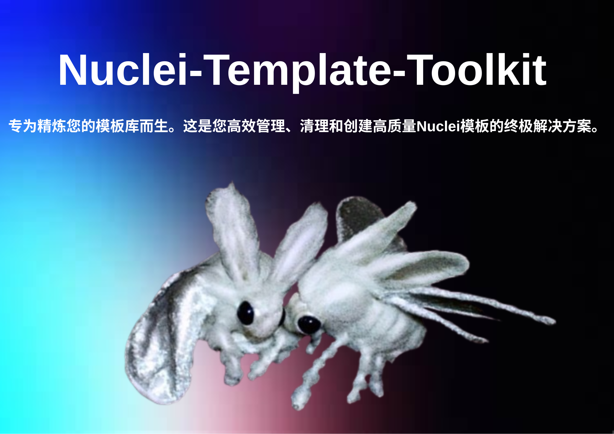
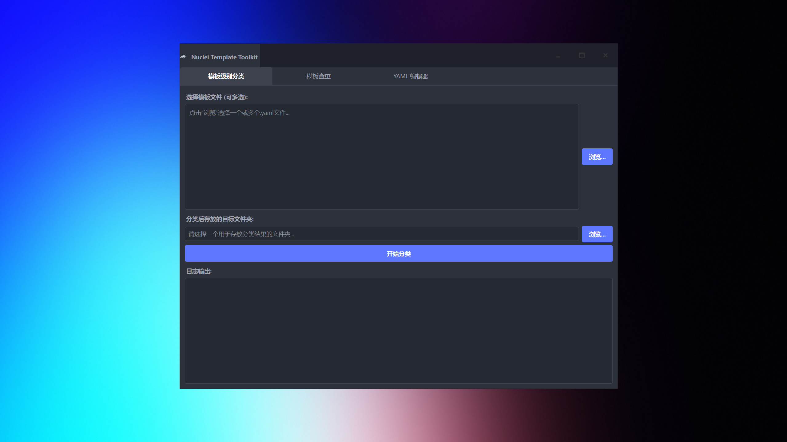

  

  <a href="README.md">English</a> | <strong>中文</strong>

  <a href="#-功能特性">功能特性</a> •
  <a href="#-安装与使用">使用方法</a> •
  <a href="#-界面截图">界面截图</a> •
  <a href="#-下载">下载</a>

---

## ✨ 功能特性

-   **模板级别分类**: 根据模板的严重性或风险级别（`critical`, `high`, `medium`, `low`, `info`）自动将其整理到不同文件夹中。
-   **模板查重**: 基于模板的唯一 `id` 或精确的文件内容（SHA-256哈希值）来查找重复的模板。
-   **YAML 编辑器**: 一个带有语法高亮的简单编辑器，用于快速创建或修改Nuclei模板。
-   **现代化界面**: 基于 PySide6 构建的、整洁、响应式的暗色主题用户界面。
-   **跨平台**: 已打包为 Windows 单一可执行文件，无需安装。

## 🚀 安装与使用

本程序为绿色软件！

1.  前往 [**Releases (发布)**](https://github.com/opium-00pium/Nuclei-Template-Toolkit/releases) 页面。
2.  下载最新的 `.exe` 文件（`Nuclei-Template-Toolkit-V1.0-zh-CN.exe`）。
3.  直接双击运行程序即可！

## 📸 界面截图

<!-- 截图路径也是相对路径 -->

## 📥 下载

您可以从官方的 **[Releases (发布)](https://github.com/opium-00pium/Nuclei-Template-Toolkit/releases)** 页面下载最新的 Windows 版本。

---

本项目由 ❤️ 驱动开发，灵感源自安全社区的优秀工具。

---

**🔓 如果 Star 数量超过 50，我将开放源代码！ ⭐**

