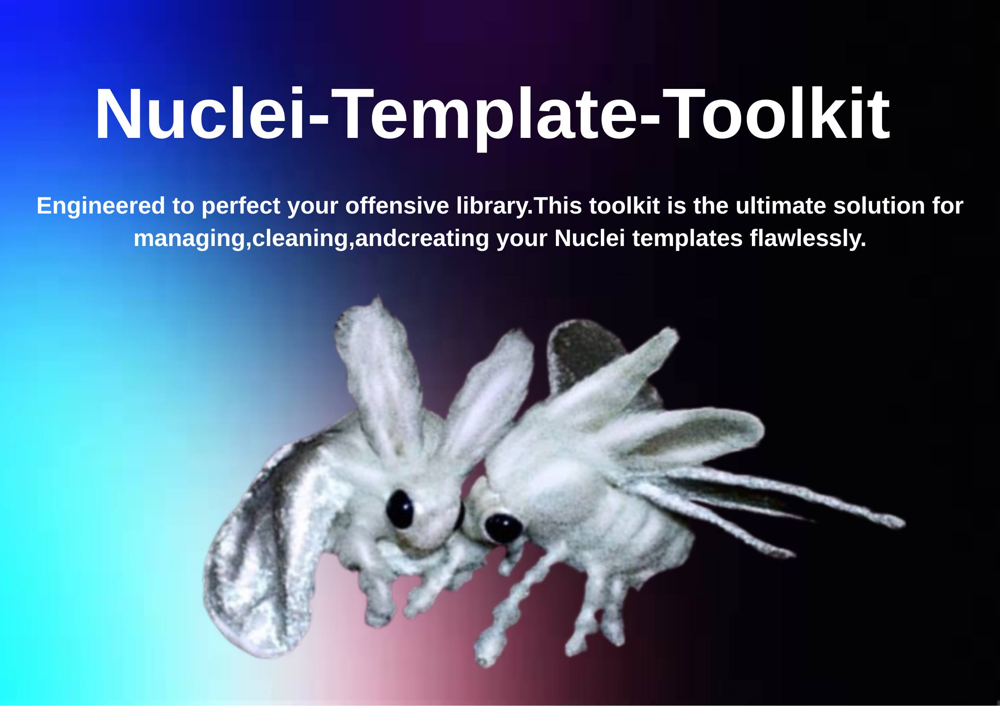

  

  <strong>English</strong> | <a href="README-zh.md">中文</a>

  <a href="#-features">Features</a> •
  <a href="#-installation--usage">Usage</a> •
  <a href="#-screenshots">Screenshots</a> •
  <a href="#-download">Download</a>

---

## ✨ Features

-   **Template Classifier**: Automatically organize your Nuclei templates into folders based on their severity or risk level (`critical`, `high`, `medium`, `low`, `info`).
-   **Template Deduplicator**: Find duplicate templates based on their unique `id` or exact file content (SHA-256 hash).
-   **YAML Editor**: A simple editor with syntax highlighting for creating or modifying Nuclei templates on the fly.
-   **Modern UI**: A clean, dark-themed, and responsive user interface built with PySide6.
-   **Cross-Platform**: Packaged as a single executable file for Windows, no installation required.

## 🚀 Installation & Usage

 This is a portable application.

1.  Go to the [**Releases**](https://github.com/opium-00pium/Nuclei-Template-Toolkit/releases) page.
2.  Download the latest `.exe` file (`Nuclei-Template-Toolkit-V1.0.exe`).
3.  Run the executable. That's it!

## 📸 Screenshots

<!-- The screenshot path is also relative -->

## 📥 Download

You can download the latest version for Windows from the official **[Releases](https://github.com/opium-00pium/Nuclei-Template-Toolkit/releases)** page.

---

This project is developed with ❤️ and is inspired by the great tools from the security community.

---

**⭐ The project is open source code! ⭐**

